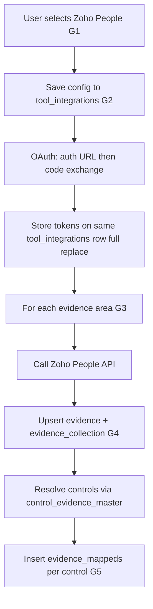

# Zoho (Zoho People) — HRMS integration (complete flow)

This document is the **Zoho-specific walkthrough**. The **generic rules** for tables, uniqueness, and control mapping live in **[0001 - initialising.md](0001%20-%20initialising.md)**. Below, those steps are numbered **G1–G5** (generic) and folded into a **single Zoho sequence** you can implement end to end.

---

## Relationship to `0001 - initialising.md`

| Generic step in `0001` | What it means for Zoho People |
|------------------------|-------------------------------|
| **G1** — User selects tool and supplies data to start | User picks **Zoho People** (HRMS) and submits the payload below (or starts OAuth from saved config). |
| **G2** — Persist in `tool_integrations` | Store OAuth config and later tokens for `(organization_id, tool_id)`. |
| **G3** — Resolve `evidence_masters` | For each evidence you collect, the row’s **`name`** in `evidence_masters` must match how you key that dataset (e.g. *Employee Master List*). |
| **G4** — `evidence` + `evidence_collection` | Call Zoho People APIs; upsert **`evidence`** (unique `organization_id` + `title`); record the run in **`evidence_collection`**. |
| **G5** — `evidence_mappeds` via `control_evidence_master` | Link each saved **`evidence`** row to one or more **controls** using `evidence_masters` PK → `control_evidence_master` → `evidence_mappeds`. |

**Uniqueness and full replace** (from `0001`, applies here):

- **`tool_integrations`**: unique `(organization_id, tool_id)` — **update** the same row; **full replace** stored fields (no partial merge).
- **`evidence`**: unique `(organization_id, title)` per org — on re-collection, **update** that row; **full replace** body/metadata as required.

---

## Initial payload (after G1)

The UI sends:

```json
{
  "org_id": "019ce23e-66b9-71fa-8223-8d66f1925bd5",
  "user_id": "019ce23e-67e0-702e-957d-ab3af1f8a619",
  "tool_id": "019ce23d-c16d-7304-a8b5-3500e3cbadbc",
  "configuration_data": {
    "client_id": "1000.JX39AHRQ82RG0TSZUYJ1WSU99S7ULW",
    "client_secret": "4136fb0f1435598dd1428d3cc6e11a80ab030b0a40",
    "redirect_uri": "http://localhost:8006/hrms/zoho/callback",
    "region": "in"
  }
}
```

Persist **`client_id`**, **`client_secret`**, **`redirect_uri`**, **`region`** (and `org_id` / `user_id` / `tool_id` per your schema) on **`tool_integrations`** — **G2**.

---

## Phase A — OAuth (prerequisite for API calls)

Zoho evidence collection needs valid tokens on the same **`tool_integrations`** row.

1. Using **`client_id` / `client_secret`** (and region-appropriate Zoho Accounts host), build the **authorize URL** (scopes for Zoho People as required by your app).

2. Return that URL to the UI; the **user opens it**, logs in, and approves.

3. Zoho redirects to **`redirect_uri`** with an **`code`** (authorization code).

4. **Exchange** `code` for **`access_token`**, **`refresh_token`**, and token lifetime fields Zoho returns.

5. **Save** on the existing `tool_integrations` row: `client_id`, `client_secret`, `redirect_uri`, `region`, plus **`access_token`**, **`refresh_token`**, and expiry — **full replace** of the integration payload for that row when reconnecting (per `0001`).

Until this phase succeeds, do not run evidence collection that requires authenticated People API calls.

---

## Phase B — Evidence inventory (G3)

For **each** row in the table below, you must have a matching **`evidence_masters.name`** (or equivalent) so **G3** can resolve *which* master row drives collection and control mapping.

| # | Evidence area (use as `evidence.title` / master `name` per your naming convention) |
|---|-------------------------------------------------------------------------------------|
| 1 | Exit Employee Records |
| 2 | Employee Master List |
| 3 | Active Employees List |
| 4 | Terminated Employees List |
| 5 | Department Structure |
| 6 | Reporting Hierarchy |
| 7 | Employee Email List |
| 8 | Attendance Logs |
| 9 | Timesheet Records |
| 10 | Leave Records |
| 11 | Training Completion Records |
| 12 | Policy Acknowledgement Records |
| 13 | New Hire Records |
| 14 | Exit Clearance Status |

**G3 in practice:** given `tool_id` (Zoho People) and the chosen evidence key (e.g. *Employee Master List*), load **`evidence_masters`** where the name matches; if missing, skip or fail according to product rules.

---

## Phase C — Collect and persist (G4)

For **each** evidence type you collect:

1. Call the appropriate **Zoho People** API (reports, modules, or bulk export — per Zoho’s API for that dataset) using **`access_token`** (refresh when expired using **`refresh_token`**).

2. **Upsert `evidence`**: key = **`organization_id`** + **`title`** (title aligned with the evidence area name above). Replace stored content **fully** on update (`0001`).

3. Insert or update **`evidence_collection`** to record this collection run (timestamps, status, raw reference ids — as your columns require).

Repeat for all 14 areas you enable.

---

## Phase D — Map to controls (G5)

This mirrors **`0001`** step 5.

1. **`evidence_id`** in **`evidence_mappeds`** = the **`evidence.id`** just written/updated for that collection.

2. **`evidenceable_type`** = `App\Models\Control` (string stored as in your DB / Laravel parity).

3. **`evidenceable_id`** = the **control** id.

**How to find controls (`0001`):** the **`evidence_masters`** row used for this evidence has a primary key; **`control_evidence_master`** links that PK to **one or more** `control_id` values (**one-to-many**). For **each** such control, insert (or replace, per your rules) a row in **`evidence_mappeds`**: same `evidence_id`, same `evidenceable_type`, different `evidenceable_id` when multiple controls apply.

---

## End-to-end sequence (summary)



---

## References

- **[0001 - initialising.md](0001%20-%20initialising.md)** — generic steps, `evidence_masters`, `evidence`, `evidence_collection`, `control_evidence_master`, `evidence_mappeds`, uniqueness, full-replace updates.
- **`db_structure/`** — concrete column types and PNG diagrams for those tables.
